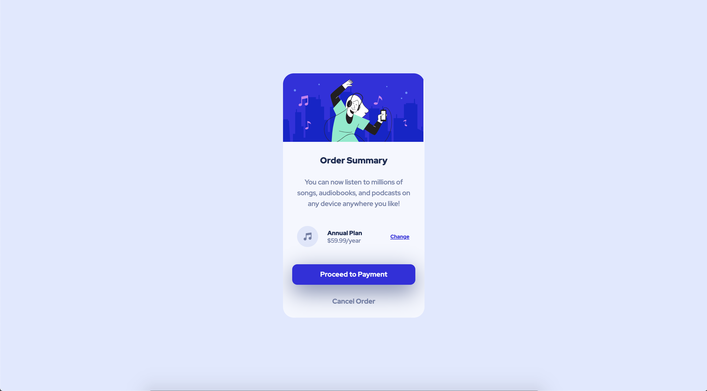

# Frontend Mentor - Order summary card solution

This is a solution to the [Order summary card challenge on Frontend Mentor](https://www.frontendmentor.io/challenges/order-summary-component-QlPmajDUj). Frontend Mentor challenges help you improve your coding skills by building realistic projects. 

## Table of contents

- [Overview](#overview)
  - [The challenge](#the-challenge)
  - [Screenshot](#screenshot)
  - [Links](#links)
- [My process](#my-process)
  - [Built with](#built-with)
  - [What I learned](#what-i-learned)
  - [Continued development](#continued-development)
  <!-- - [Useful resources](#useful-resources) -->
- [Author](#author)
<!-- - [Acknowledgments](#acknowledgments) -->

## Overview

### The challenge

Your challenge is to build out this order summary card component and get it looking as close to the design as possible   

You can use any tools you like to help you complete the challenge. So if you've got something you'd like to practice, feel free to give it a go.

Users should be able to:

- See hover states for interactive elements

### Screenshot
**My solution:**

### Links

<!-- - Solution URL: [github](https://github.com/tristansetha/order-summary-component-main) -->
- Live Site URL: [Live Site](https://tristansetha.github.io/order-summary-component-main)

## My process

Big -> Medium -> Small

### Built with

- Semantic HTML5 markup
- CSS custom properties
- Flexbox
- CSS Grid

### What I learned

Learned the importance of planning before starting to code. Start with a low fidelity prototype.   

CSS variables

### Continued development

Learn about mobile first development

<!-- ### Useful resources -->

<!-- - [Example resource 1](https://www.example.com) - This helped me for XYZ reason. I really liked this pattern and will use it going forward.
- [Example resource 2](https://www.example.com) - This is an amazing article which helped me finally understand XYZ. I'd recommend it to anyone still learning this concept. -->

## Author

- Frontend Mentor - [@yourusername](https://www.frontendmentor.io/profile/tristansetha)

<!-- ## Acknowledgments -->

